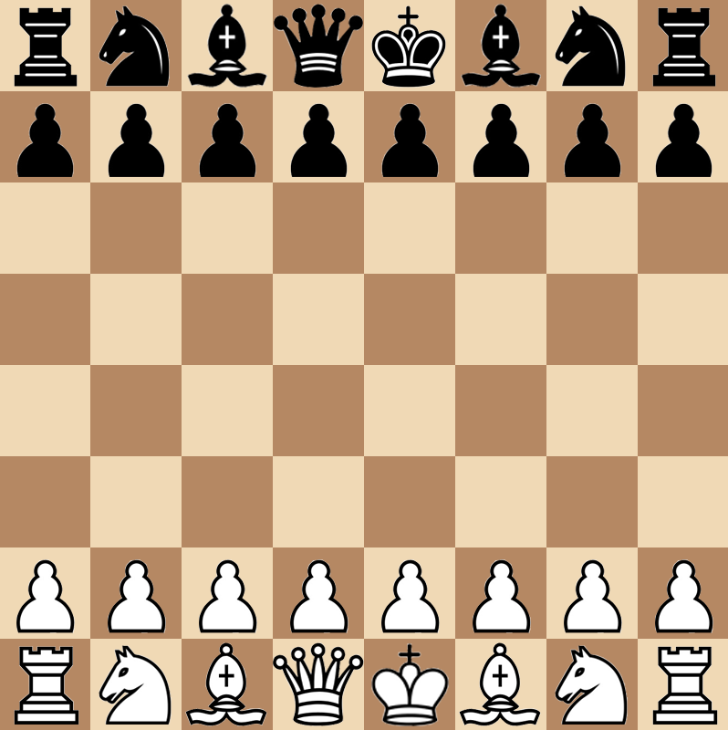

    

    <h2 align="center">Chess in C++, using the SFML library</h2>

<h3 align="center">
<a href="https://github.com/Nikkkt/Chess-project/blob/main/chess/main.cpp">
Main code file
</a></h3>

<h3 align="center">
<a href="https://github.com/Nikkkt/Chess-project/blob/main/chess/logic.h">Logic header file
</a></h3>

 

    

<strong>"ShoSho?" Team</strong>

<a href="https://github.com/aokiji123"><i>Bogdan Tolmachev</i></a>, <a href="https://github.com/Nikkkt"><i>Terpilovskyi Nikita</i></a>, <a href="https://github.com/SlavikArt"><i>Viacheslav Artsybashev</i></a>

